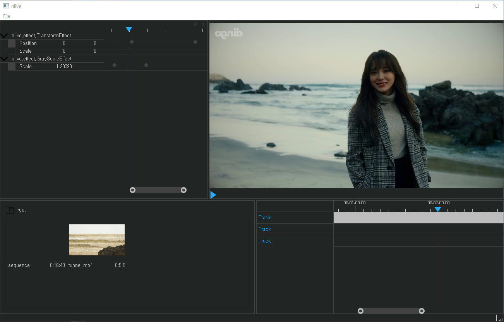

# Nlive Video Editor

Nlive is a free, open-source video editor for Windows, macOS and Linux.

Nlive is succeed to [Olive](https://github.com/orange4glace/olive), which is also a non-linear video editor, based on Electron. On the other hand, Nlive is built on Qt5.

## Build Instructions

1. Get all the prerequisites described below

* CMake
  * Nlive uses CMake for meta build system.
* Qt5
  * Nlive is based on Qt5
* Boost
  * with `Boost_USE_STATIC_LIBS=ON`
* OpenGL
  * Nlive uses OpenGL for rendering
* FFmpeg >= 3.4
  * Nlive uses FFmpeg for decoding. Make sure the version is higher or equal than 3.4
* spdlog
  * Nlive uses spdlog for logging

2. Make sure [CMake can find packages](https://cmake.org/cmake/help/v3.8/command/find_package.html) *Qt5*, *Boost*, *OpenGL*, *FFmpeg*, *spdlog*. The easist way is setting `CMAKE_PREFIX_PATH` environment variable as include paths and library paths of those. You need to add 4 paths which are

* `QT5_BASE_PATH/QT5_VERSION/QT5_COMPILER/lib/cmake/Qt5`
* `FFMPEG_BASE_PATH/lib`
* `FFMPEG_BASE_PATH/include`
* `SPDLOG_BASE_PATH/include`

And one last additional environment variable to find *Boost*

As for me, on Windows 10 with MSVC 2017,

`%CMAKE_PREFIX_PATH% = Q:\Qt\5.13.0\msvc2017_64\lib\cmake\Qt5;D:\cpplib\ffmpeg-3.4\lib;D:\cpplib\ffmpeg-3.4\include;D:\cpplib\spdlog\include;`

`%BOOST_ROOT% = D:\cpplib\boost_1_70_0;`
`%BOOST_INCLUDEDIR% = D:\cpplib\boost_1_70_0\boost;`
`%BOOST_LIBRARYDIR% = D:\cpplib\boost_1_70_0\lib64-msvc-14.1;`

3. Get sources from git

   > git clone https://github.com/orange4glace/nlive.git
  
4. Create build folder

   > cd nlive

   > mkdir build
   
   > cd build

5. Build the source with any way you want. We recommend you to use [*Ninja*](https://ninja-build.org/).

   > cmake -G Ninja ..

   > ninja

6. Copy and paste necessary dynanmic libs. (*\*.dll* or *\*.a*)

7. Run your program.